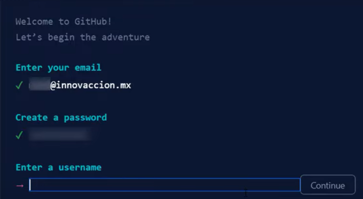
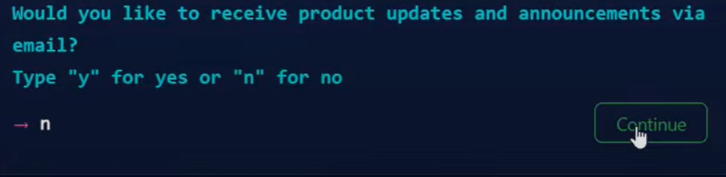
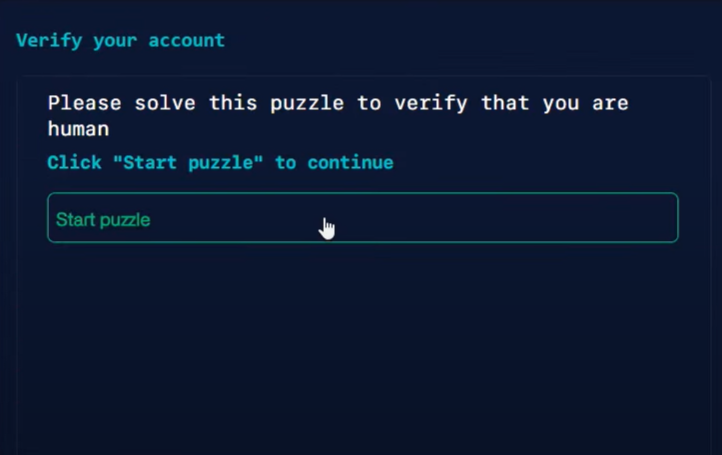
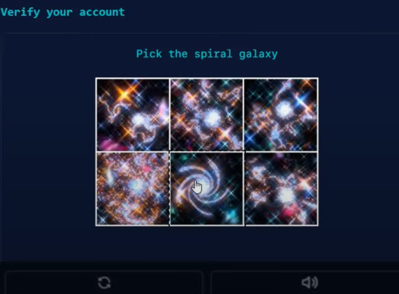
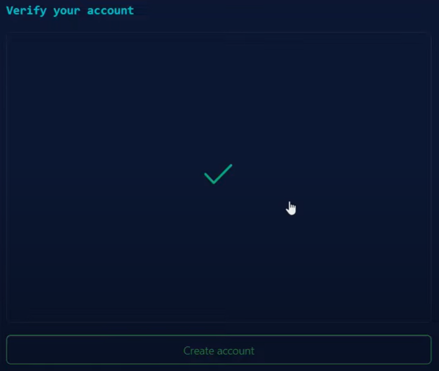
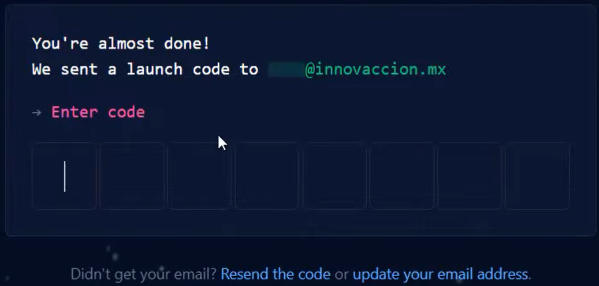
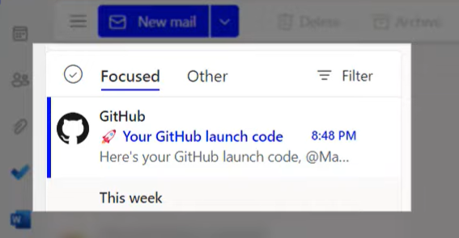
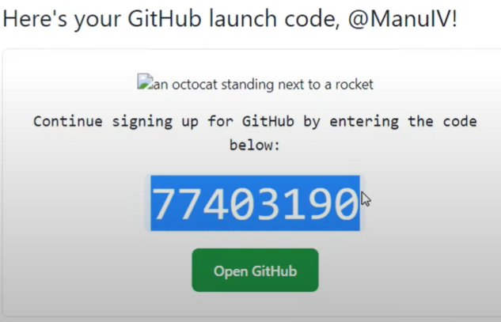
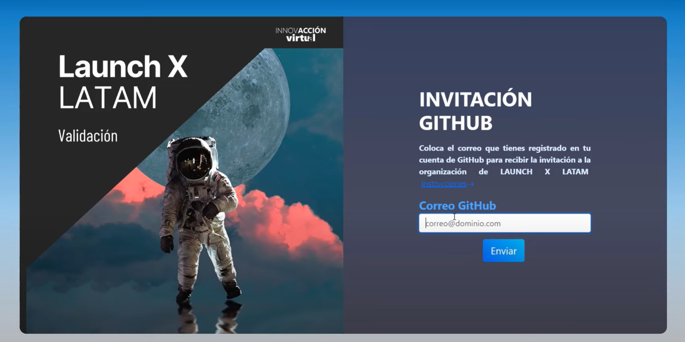
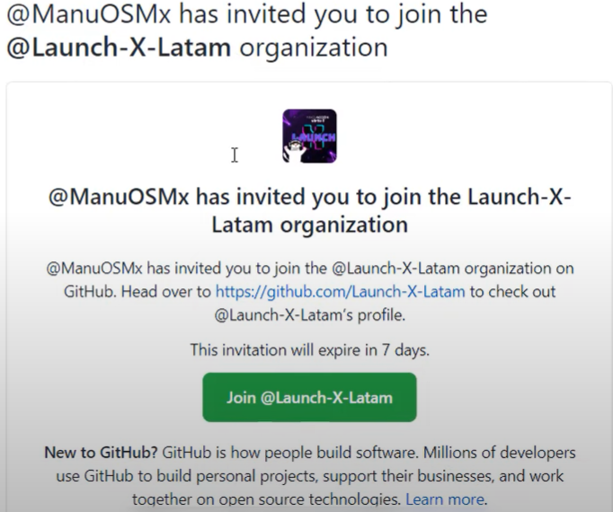

# Dar de alta tu cuenta de GitHub

## Video tutorial

Aquí te dejamos un **vídeo tutorial** que puedes seguir paso a paso el proceso de creación de tu cuenta de GitHub y así poder unirte a la organización oficial de **Launch X LATAM**.

*Da click sobre la imagen*

> Si no se visualiza el vídeo, puedes dar click aquí: [https://www.youtube.com/watch?v=Kvas7SOPa9w](https://www.youtube.com/watch?v=Kvas7SOPa9w)

### LINKS IMPORTANTES:

- Registrarte en GitHub: [https://github.com/signup](https://github.com/signup)
- Entrar a la organización: [https://launchxauth.azurewebsites.net/](https://launchxauth.azurewebsites.net/joingh)

Si lo prefieres, puedes seguir el proceso que se encuentra a continuación:

##  Etapa 1: Creación de una cuenta en GitHub
---

> Si ya tienes una cuenta de GitHub, puedes pasar a la [Etapa 2](#etapa-2-unirte-a-la-organización-de-launch-x-latam).

### 1.1. Crear una cuenta en GitHub
-  Acceder al sitio oficial de GitHub y crear una cuenta. Para ello, haz click en este enlace: [GitHub](https://github.com/signup)
- Al abrirse la siguiente ventana, llena los campos necesarios con:
    - Correo electrónico de preferencia.
    - Una contraseña segura.
    - Un nombre de usuario.

 

- Te preguntará si quieres recibir correos de GitHub, puedes seleccionar la opción de tu preferencia. En esta ocasión, seleccionaremos: **"n"**.

- Verificaremos que somos humanos, demos click en *Start puzzle*, posteriormente, seleccionaremos las imágenes correspondientes a las que nos soliciten.

 

- Al finalizar, nos aparecerá una paloma verde, indicando que completamos la verificación. Ahora le daremos click al botón *Create account*

### 1.2. Verificar tu cuenta de correo electrónico

a) Nos aparecerá ahora una ventana en la que nos pide un código de verificación, este código **fue enviado a nuestro correo electrónico** que anotamos anteriormente.

b) Nos dirigiremos a nuestro correo electrónico y buscaremos el correo de GitHub, en el cual nos aparecerá el código de verificación.

c) Copiaremos el código de verificación y lo pegaremos en la ventana de GitHub que nos apareció en el paso: **a)**.

### 1.3. Personalizar tu cuenta de GitHub

- Abrirá una página en la que nos pedirá que personalicemos nuestra cuenta de GitHub. Seleccionaremos: 
    - *Just me*
    - *Student*

- En el siguiente paso, nos pedirá intereses específicos, selecciona las opciones que más te gusten. *Un Ejemplo: **Collaborating coding** y **Communities***

- Finalmente seleccionaremos el plan gratuito de GitHub.

**¡LISTO! Ya tenemos nuestra cuenta de GitHub creada.** 

>Ahora, vamos a dar de alta nuestra cuenta en la organización oficial de **LAUNCH X LATAM**.

## Etapa 2: Unirte a la organización de Launch X LATAM
---

### 2.1. Validar nuestro correo de GitHub

Si has seguido todos los pasos de la etapa 1 correctamente, ahora puedes validar tu correo de GitHub para entrar a la organización, para ello, sigue los siguientes puntos:

- Entrar a [https://launchxauth.azurewebsites.net/](https://launchxauth.azurewebsites.net/joingh)

- Llenar el campo con tu correo de GitHub.
- Dar click en el botón **"Enviar"**
- Esperamos a que aparezca el mensaje: *"Se ha enviado el correo"*

- Abrir nuestro correo que usamos para crear la cuenta de GitHub. Te llegará un correo de **GitHub** en el cual vendrá la invitación de **Launch X LATAM**.

- Daremos click en el botón verde **"Join @Launch-X-Latam"**

**¡FELICITACIONES! Ya estás dentro de la organización oficial de esta edición.** 

> Mantente al pendiente de tu correo y de nuestras redes sociales para conocer los próximos pasos.

### [REGRESAR AL ONBOARDING](https://github.com/Launch-X-Latam/OnBoarding)

## Dudas

¿Tienes alguna duda o sugerencia? 

Escríbenos a: [contacto@innovaccion.mx](mailto:contacto@innovaccion.mx)

*Atte: Equipo de Innovacción*
