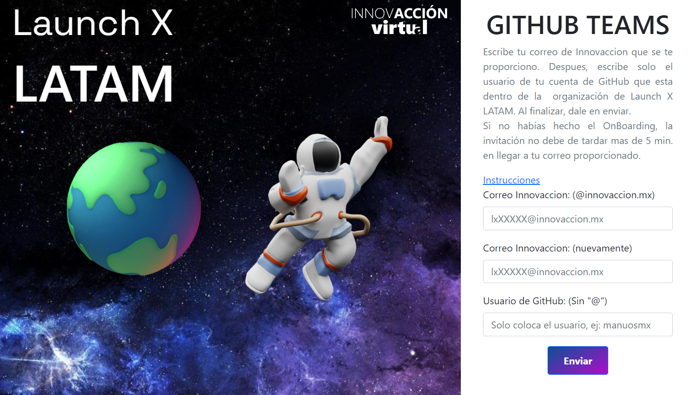
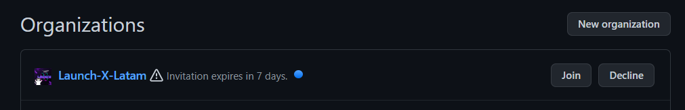
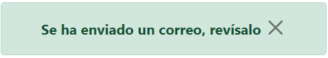
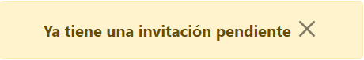

# Entrar a las equipos de GitHub

Ahora se explicará como podrán unirse a los equipos de GitHub para que puedan tener acceso a los repositorios de las Misiones **Front-end** y **Back-end**.

- Entrar a [https://launchxauth.azurewebsites.net/](https://launchxauth.azurewebsites.net/jointeams)

- Llenar el campo con tu correo de **LaunchX LATAM** (Recuerda que el correo tiene el formato: **lx00000@innovaccion.mx** ).
- Llenamos el segundo campo volviendo a colocar el mismo correo para **verificar que esté bien escrito**.
- Ahora, colocaremos el **nombre de usuario** de GitHub (de tu preferencia) que usaremos para añadirlo a los equipos de GitHub.
- Dar click en el botón **"Enviar"**.

Si lo has hecho todo bien, te mostrará el siguiente mensaje:

## Verificar que se haya añadido correctamente
---

**Si ya estabas en la organización**, puedes verificar que te has unido a los equipos de Github en el siguiente enlace: [https://github.com/orgs/Launch-X-Latam/teams](https://github.com/orgs/Launch-X-Latam/teams)

> Deberás ver algo como esto:

**Si es la primera vez que te unes a la organización** , te llegará un correo para aceptarlo o tambien puedes verificarlo en este enlace: [https://github.com/settings/organizations](https://github.com/settings/organizations)

> ¿Te mostró un mensaje distinto? Puedes revisar en [Otros Casos](#otros-casos) el mensaje que te apareció y que significa

**¡FELICITACIONES! Ya estás dentro de la organización oficial de esta edición.** 

> Mantente al pendiente de tu correo y de nuestras redes sociales para conocer los próximos pasos.

### [REGRESAR AL ONBOARDING](https://github.com/Launch-X-Latam/OnBoarding)

## Otros casos
---
### Mensajes
|            Mensaje                     | Descripción|
|----------------------------------------|------------|
|| **Se ha enviado un correo** se muestra cuando es la primera vez que haces el proceso en general, tienes que aceptar la invitación que te llegó al correo o tambien aquí: [https://github.com/settings/organizations](https://github.com/settings/organizations)|
|| **Ya te encuentras en los equipos** Se muestra cuando ya te has unido a todos los equipos de esta edición. No hace falta hacer nada.|
|    | **Ya tienes una invitación pendiente** se muestra cuando ya habias hecho el proceso anteriormente pero no aceptaste la invitación. Puedes verificar si tienes una invitación pendiente: [https://github.com/settings/organizations](https://github.com/settings/organizations)|

### Errores
|            Mensaje                     | Descripción del error |
|----------------------------------------|------------|
|| **Los correos no coinciden** se muestra cuando uno de los emails esta escrito de forma distinta, prueba nuevamente ingresandolos y verifica que estén bien antes de darle en enviar.|
|    | **No se encontró el correo** se muestra cuando colocas un email diferente al de la edición actual. Verifica que estás usando el email de @innovaccion.mx . Si el correo es correcto y te aparece que no existe, puedes mandar un correo al contacto que se encuentra en [Dudas](#dudas). |
|| **El usuario de GitHub no existe** se muestra cuando el usuario ingresado está mal escrito o aun no se ha creado. Verifica que esté bien escrito e intentalo nuevamente.|

## Dudas

¿Tienes alguna duda o problema con el proceso? 

Contactame a: [manu@innovaccion.mx](mailto:manu@innovaccion.mx)

*Atte: Equipo de Innovacción*
